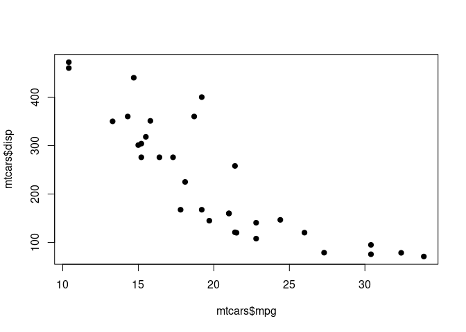

```r
# Qui definiamo delle funzioni che possono essere utili globalmente

mean_sd <- function(x){
  sprintf("(M = %s, SD = %s)",
          round(mean(x), 2),
          round(sd(x), 2))
}
```

# Sintassi Markdown

Abbiamo visto che la sintassi Mardown è molto semplice e leggibile. Possiamo mettere in **grassetto**, *corsivo* ed anche ~~barrare~~ una parola. 

Gli spazi   tra le parole non vengono intepretati come in Word, infatti possiamo mettere quanti spazi      vogliamo (visibile solo nel file `.Rmd`) ma il risultato sarà sempre lo stesso.

Per fare un nuovo paragrafo (a capo con uno spazio) dobbiamo inserire una linea vuota tra una porzione di testo e l'altra.

```
... e con questo finiamo il primo paragrafo.

In questo modo possiamo avere un nuovo paragrafo. 
Se non mettiamo la linea bianca il testo continuerà sulla stessa riga.
```

Se vogliamo inserire una porzione di codice, senza eseguirlo ma solo per distinguerlo dal testo possiamo racchiudere il testo tra 3 backticks:

```
print("Hello World!")
```

Se vogliamo possiamo anche specificare il linguaggio del codice in modo da evidenziare le parti principali:

```python
x = 1:10
print(x)
```

Possiamo anche usare il codice inline usando 2 backtics per differenziare una porzione di `codice` direttamente nel testo.

Possiamo inserire delle footnotes usando la sintassi `^[testo]` dove `testo` è il contenuto della footnote. Questo è comodo perchè la scriviamo direttamente nel testo e non alla fine della pagina^[Questa è la mia footnote].

In generale, possiamo usare tutta la sintassi Markdown, e ci sono moltissime guide per impararla.

# Sintassi R Markdown

Essendo R Markdown l'implementazione del linguaggio R, la sintassi per alcune operazioni è leggermente diversa da quella markdown. Per esempio il blocco di codice:

```r
x <- 1:10
print(x)
```
E' un blocco di codice generico che non viene interpretato. Se usiamo la sintassi di R Markdown:


```r
x <- 1:10
print(x)
```

```
##  [1]  1  2  3  4  5  6  7  8  9 10
```

Allora il codice viene anche eseguito e il risultato viene inserito direttamente nel documento.

Lo stesso vale per un grafico:


```r
plot(mtcars$mpg, mtcars$disp, pch = 19)
```

<!-- -->

# Citazioni

Anche le citazioni sono facilissime da inserire. Quando citiamo nel testo vogliamo citare nel classico modo `(autore, anno)` oppure usare solo `(anno)` perchè citiamo il nome nel testo principale. Possiamo citare specificando il file `.bib` nello `YAML` e poi `[@key]`:

- citazione normale: [@xie2018r]
- citazione senza autore: [-@xie2018r]
- citazione multipla: [@xie2018r; @vogel2004]

Chiaramente se dovete cambiare lo stile (e.g., da APA a Chicago), sarà sufficiente cambiare il file `.csl` e ricompilare il documento. Le citazioni vengono poi inserite in automatico alla fine del documento.

# La vera potenza di R Markdown

Il vero aspetto centrale di R Markdown è quello di poter automatizzare alcune operazioni che di solito sono tediose e con alta proababilità di errore. Ad esempio se dobbiamo riportare delle statistiche, solitamente dobbiamo scrivere manualmente i numeri, le parentesi, etc. Mentre se usiamo un documento R Markdown, codice, dati e testo sono tutti insieme. Facciamo un esempio:

Usiamo il dataset presente in R `mtcars` e immaginiamo sia il vostro dataset che dovere usare per la tesi o per il vostro report di analisi.


```r
mtcars
```

```
##                      mpg cyl  disp  hp drat    wt  qsec vs am gear carb
## Mazda RX4           21.0   6 160.0 110 3.90 2.620 16.46  0  1    4    4
## Mazda RX4 Wag       21.0   6 160.0 110 3.90 2.875 17.02  0  1    4    4
## Datsun 710          22.8   4 108.0  93 3.85 2.320 18.61  1  1    4    1
## Hornet 4 Drive      21.4   6 258.0 110 3.08 3.215 19.44  1  0    3    1
## Hornet Sportabout   18.7   8 360.0 175 3.15 3.440 17.02  0  0    3    2
## Valiant             18.1   6 225.0 105 2.76 3.460 20.22  1  0    3    1
## Duster 360          14.3   8 360.0 245 3.21 3.570 15.84  0  0    3    4
## Merc 240D           24.4   4 146.7  62 3.69 3.190 20.00  1  0    4    2
## Merc 230            22.8   4 140.8  95 3.92 3.150 22.90  1  0    4    2
## Merc 280            19.2   6 167.6 123 3.92 3.440 18.30  1  0    4    4
## Merc 280C           17.8   6 167.6 123 3.92 3.440 18.90  1  0    4    4
## Merc 450SE          16.4   8 275.8 180 3.07 4.070 17.40  0  0    3    3
## Merc 450SL          17.3   8 275.8 180 3.07 3.730 17.60  0  0    3    3
## Merc 450SLC         15.2   8 275.8 180 3.07 3.780 18.00  0  0    3    3
## Cadillac Fleetwood  10.4   8 472.0 205 2.93 5.250 17.98  0  0    3    4
## Lincoln Continental 10.4   8 460.0 215 3.00 5.424 17.82  0  0    3    4
## Chrysler Imperial   14.7   8 440.0 230 3.23 5.345 17.42  0  0    3    4
## Fiat 128            32.4   4  78.7  66 4.08 2.200 19.47  1  1    4    1
## Honda Civic         30.4   4  75.7  52 4.93 1.615 18.52  1  1    4    2
## Toyota Corolla      33.9   4  71.1  65 4.22 1.835 19.90  1  1    4    1
## Toyota Corona       21.5   4 120.1  97 3.70 2.465 20.01  1  0    3    1
## Dodge Challenger    15.5   8 318.0 150 2.76 3.520 16.87  0  0    3    2
## AMC Javelin         15.2   8 304.0 150 3.15 3.435 17.30  0  0    3    2
## Camaro Z28          13.3   8 350.0 245 3.73 3.840 15.41  0  0    3    4
## Pontiac Firebird    19.2   8 400.0 175 3.08 3.845 17.05  0  0    3    2
## Fiat X1-9           27.3   4  79.0  66 4.08 1.935 18.90  1  1    4    1
## Porsche 914-2       26.0   4 120.3  91 4.43 2.140 16.70  0  1    5    2
## Lotus Europa        30.4   4  95.1 113 3.77 1.513 16.90  1  1    5    2
## Ford Pantera L      15.8   8 351.0 264 4.22 3.170 14.50  0  1    5    4
## Ferrari Dino        19.7   6 145.0 175 3.62 2.770 15.50  0  1    5    6
## Maserati Bora       15.0   8 301.0 335 3.54 3.570 14.60  0  1    5    8
## Volvo 142E          21.4   4 121.0 109 4.11 2.780 18.60  1  1    4    2
```

Solitamente nel metodo di un articolo o di un report è necessario descrivere il dataset e riportare alcune statistiche descrittive. Con R Markdown posso usare dei code chunks (sia inline che come blocco) e usare delle funzioni R che producono del testo, senza scrivere direttamente i valori.

> Ad esempio: Il dataset `mtcars` ha 32 osservazioni e 11 variabili. La variabile più importante è `mpg` (M = 20.09, SD = 6.03) (se state guardando il documento compilato guardate nel file `.Rmd` come i numeri vengono generati).

Questo diventa ancora più rilevante se i dati in input cambiano. Se dobbiamo analizzare nuovamente i dati, cambiare delle parti o aggiornare, normalmente è necessario riscrivere tutto. In questo caso, semplicemente cambiando `mtcars` possiamo aggiornare tutto il testo che è legato ad `mtcars`:


```r
# aggiungo 10 righe a mtcars per simulare il fatto che i dati sono cambiati
mtcars <- rbind(mtcars, mtcars[1:10, ])
```

Ora "eseguo" nuovamente il codice di prima, come vedete (se state guardando il documento compilato guardate nel file `.Rmd` come i numeri vengono generati) tutto viene aggiornato senza cambiare nulla:

> Ad esempio: Il dataset `mtcars` ha 42 osservazioni e 11 variabili. La variabile più importante è `mpg` (M = 20.16, SD = 5.42) (se state guardando il documento compilato guardate nel file `.Rmd` come i numeri vengono generati).

## Statistiche più complesse

Spesso dobbiamo creare tabelle da inserire nel nostro documento. Per esempio la tabella di un'analisi che abbiamo fatto. Fittiamo un modello di regressione lineare con il dataset `iris` e proviamo a predirre `Sepal.Length` con il fattore a 3 livelli `Species`:


```r
fit <- lm(Sepal.Length ~ Species, data = iris)
summary(fit)
```

```
## 
## Call:
## lm(formula = Sepal.Length ~ Species, data = iris)
## 
## Residuals:
##     Min      1Q  Median      3Q     Max 
## -1.6880 -0.3285 -0.0060  0.3120  1.3120 
## 
## Coefficients:
##                   Estimate Std. Error t value Pr(>|t|)    
## (Intercept)         5.0060     0.0728  68.762  < 2e-16 ***
## Speciesversicolor   0.9300     0.1030   9.033 8.77e-16 ***
## Speciesvirginica    1.5820     0.1030  15.366  < 2e-16 ***
## ---
## Signif. codes:  0 '***' 0.001 '**' 0.01 '*' 0.05 '.' 0.1 ' ' 1
## 
## Residual standard error: 0.5148 on 147 degrees of freedom
## Multiple R-squared:  0.6187,	Adjusted R-squared:  0.6135 
## F-statistic: 119.3 on 2 and 147 DF,  p-value: < 2.2e-16
```

Ora vogliamo riportare tutti i valori (stime, confidence intervals e p-values) in una tabella. Possiamo crearla a mano, ma perchè non automatizzare il tutto. Ad esempio il pacchetto `sjPlot` ha diverse funzioni come `sjPlot::tab_model()`:


```r
sjPlot::tab_model(fit)
```

```
## Warning in register(): Can't find generic `scale_type` in package ggplot2 to
## register S3 method.
```

<table style="border-collapse:collapse; border:none;">
<tr>
<th style="border-top: double; text-align:center; font-style:normal; font-weight:bold; padding:0.2cm;  text-align:left; ">&nbsp;</th>
<th colspan="3" style="border-top: double; text-align:center; font-style:normal; font-weight:bold; padding:0.2cm; ">Sepal Length</th>
</tr>
<tr>
<td style=" text-align:center; border-bottom:1px solid; font-style:italic; font-weight:normal;  text-align:left; ">Predictors</td>
<td style=" text-align:center; border-bottom:1px solid; font-style:italic; font-weight:normal;  ">Estimates</td>
<td style=" text-align:center; border-bottom:1px solid; font-style:italic; font-weight:normal;  ">CI</td>
<td style=" text-align:center; border-bottom:1px solid; font-style:italic; font-weight:normal;  ">p</td>
</tr>
<tr>
<td style=" padding:0.2cm; text-align:left; vertical-align:top; text-align:left; ">(Intercept)</td>
<td style=" padding:0.2cm; text-align:left; vertical-align:top; text-align:center;  ">5.01</td>
<td style=" padding:0.2cm; text-align:left; vertical-align:top; text-align:center;  ">4.86&nbsp;&ndash;&nbsp;5.15</td>
<td style=" padding:0.2cm; text-align:left; vertical-align:top; text-align:center;  "><strong>&lt;0.001</strong></td>
</tr>
<tr>
<td style=" padding:0.2cm; text-align:left; vertical-align:top; text-align:left; ">Species [versicolor]</td>
<td style=" padding:0.2cm; text-align:left; vertical-align:top; text-align:center;  ">0.93</td>
<td style=" padding:0.2cm; text-align:left; vertical-align:top; text-align:center;  ">0.73&nbsp;&ndash;&nbsp;1.13</td>
<td style=" padding:0.2cm; text-align:left; vertical-align:top; text-align:center;  "><strong>&lt;0.001</strong></td>
</tr>
<tr>
<td style=" padding:0.2cm; text-align:left; vertical-align:top; text-align:left; ">Species [virginica]</td>
<td style=" padding:0.2cm; text-align:left; vertical-align:top; text-align:center;  ">1.58</td>
<td style=" padding:0.2cm; text-align:left; vertical-align:top; text-align:center;  ">1.38&nbsp;&ndash;&nbsp;1.79</td>
<td style=" padding:0.2cm; text-align:left; vertical-align:top; text-align:center;  "><strong>&lt;0.001</strong></td>
</tr>
<tr>
<td style=" padding:0.2cm; text-align:left; vertical-align:top; text-align:left; padding-top:0.1cm; padding-bottom:0.1cm; border-top:1px solid;">Observations</td>
<td style=" padding:0.2cm; text-align:left; vertical-align:top; padding-top:0.1cm; padding-bottom:0.1cm; text-align:left; border-top:1px solid;" colspan="3">150</td>
</tr>
<tr>
<td style=" padding:0.2cm; text-align:left; vertical-align:top; text-align:left; padding-top:0.1cm; padding-bottom:0.1cm;">R<sup>2</sup> / R<sup>2</sup> adjusted</td>
<td style=" padding:0.2cm; text-align:left; vertical-align:top; padding-top:0.1cm; padding-bottom:0.1cm; text-align:left;" colspan="3">0.619 / 0.614</td>
</tr>

</table>

# Bibliografia
