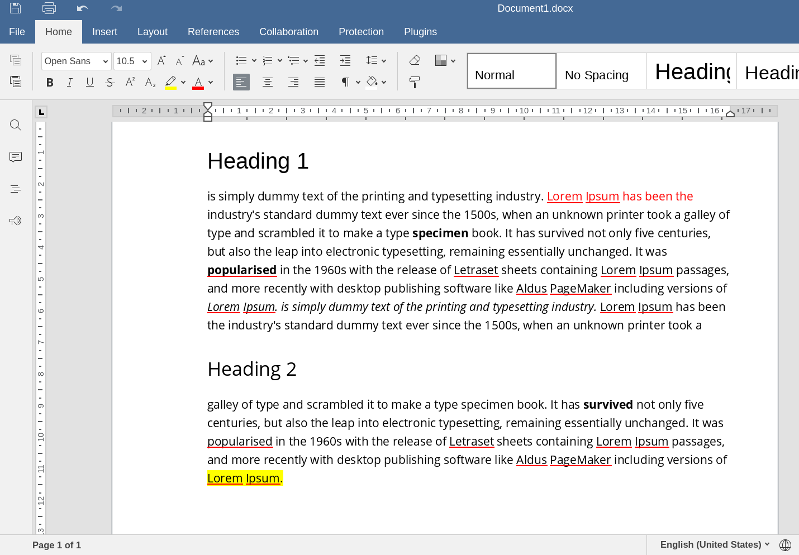
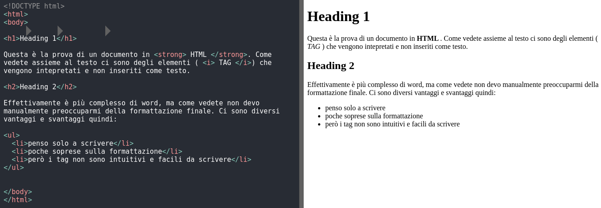
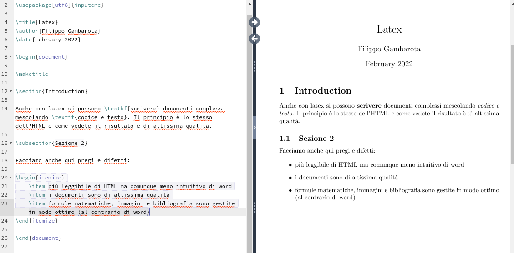
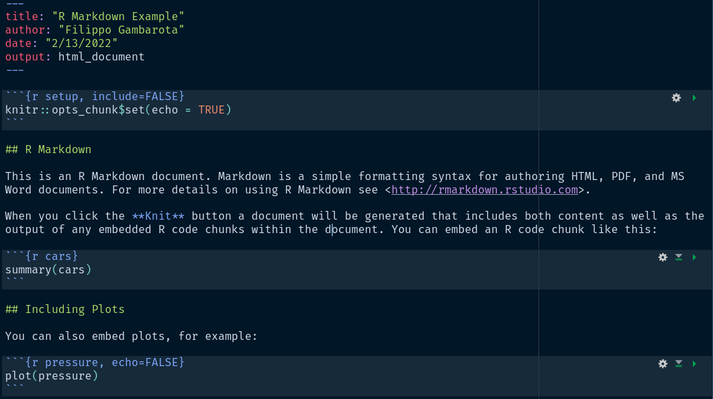
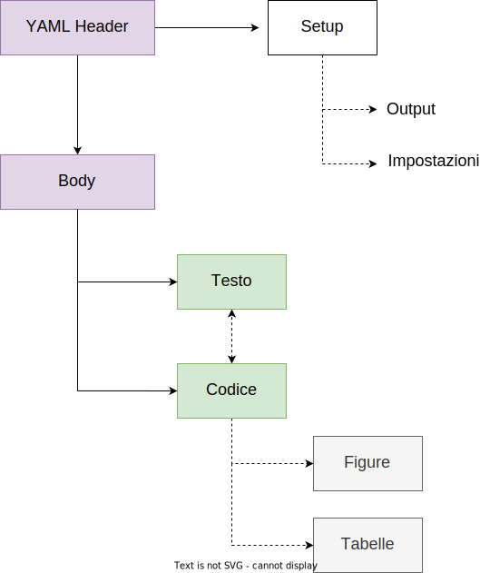
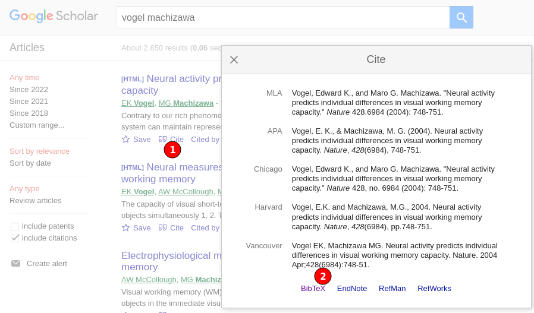
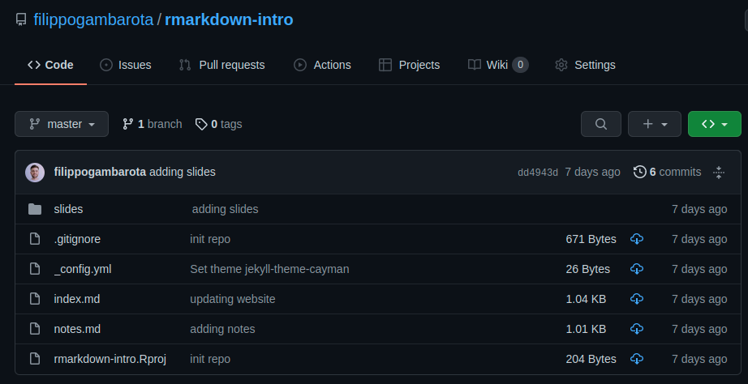
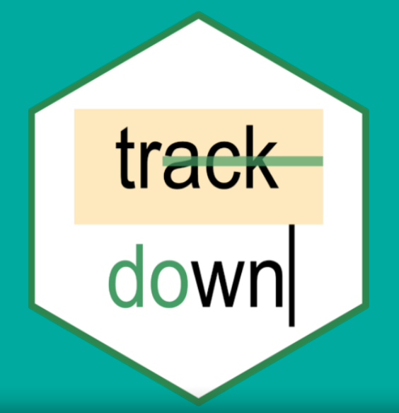
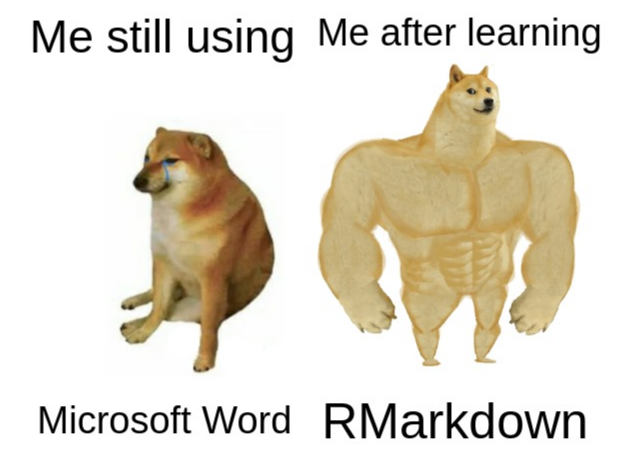

```{r setup, include=FALSE}
options(htmltools.dir.version = FALSE)
knitr::opts_chunk$set(echo = FALSE,
                      fig.align = "center",
                      dpi = 300,
                      fig.retina = 2,
                      message = FALSE,
                      warning = FALSE)
```

```{r packages}
library(tidyverse)
```


```{r functions}

# inline code formatting thanks to https://stackoverflow.com/a/20419016/9032257
rinline <- function(code){
  sprintf("<code>&grave;r %s&grave;</code>", code)
}
```

# Making documents...

Se dovete scrivere qualcosa (un report, una tesi, un documento generico) cosa vi viene in mente di utilizzare?

--

Probabilmente **Microsoft Word** oppure **Google Docs**. Sono ottimi software, molto *intuitivi*, *facili da imparare* e *estramamente popolari*.

```{r, out.width="70%"}

```

---

# The ~~pain~~ joy of making documents

Sicuramente però vi sarà capitato di dover fare operazioni complesse come:

--

- gestire documenti con molte pagine
- inserire (o modificare `r emo::ji("scream")`) figure e tabelle
- gestire bibliografia
- numerare paragrafi, tabelle e immagini

--

.pull-left[

```{r}
knitr::include_graphics("img/word_reddit_meme.gif")
```

]

.pull-right[

```{r}
knitr::include_graphics("img/word-meme.jpeg")
```

]

---

# Why?

I programmi come Microsoft Word e affini sono definiti WYSIWYG (**W**hat **Y**ou **S**ee **I**s **W**hat **Y**ou **G**et) perchè quello che vediamo mentre scriviamo è esattamente il risultato finale:

- se vogliamo mettere **grassetto** usiamo `ctrl + b` oppure clicchiamo un pulsante e vediamo subito il risultato
- se vogliamo inserire un'immagine trasciniamo il file e la spostiamo millimetro per millimetro manualmente

--

Questo ha il vantaggio di essere molto intuitivo e semplice, ma ci sono diversi svantaggi:

- non abbiamo (quasi) mai una **visione d'insieme del documento** (sposto l'immagine e non so cosa succede)
- pensiamo **contemporaneamente** al testo e alla formattazione
- versioni di Word (o equivalenti) diverse possono creare **problemi di compatibilità**
- quando il documento diventa pesante (> 30 pagine) ci possono essere **problemi di performance e formattazione**

---

# Ok.. qualche alternativa?

--

L'approccio alternativo è caratterizzato da **separare la formattazione e impaginazione (tedioso, complicato e superfluo) dal contenuto effettivo** in termini di testo.

--

Questo è possibile utilizzando **linguaggi di markup** ovvero un modo di scrivere del testo che viene **intepretato e compilato** e permette di produrre un certo tipo di risultato. Ad esempio:

--

.pull-left[

```html
<!DOCTYPE html>
<html>
<body>

<h1>My First Heading</h1>

<p>My first paragraph.</p>

</body>
</html>
```

]

--

.pull-right[

```latex
\documentclass[12pt]{article}
\usepackage{lingmacros}
\usepackage{tree-dvips}
\begin{document}

\section*{Notes for My Paper}

Don't forget to include examples of topicalization.
They look like this:

\subsection*{How to handle topicalization}

I'll just assume a tree structure like (\ex{1}).

```

]

---

# HTML

Questo è un esempio per scrivere un testo in html:

```{r, out.width="100%"}

```

---

# Latex

Questo è lo stesso esempio ma in Latex:

```{r, out.width="100%"}

```

---

# Ma cosa centra tutto questo con R?

Per documenti semplici effettivamente non è necessario imparare un linguaggio come `HTML` o `Latex`. Pensate però ad una tesi di laurea, ad un report di analisi o un documento scientifico in generale dove:

--

- **inserire statistiche** con un certo stile di formattazione
- **modificare** diversi numeri se ci sono cambiamenti nelle analisi
- **aggiornare** figure e tabelle se vengono modificate

--

Sarebbe fantastico poter unire codice (i.e., la creazione di figure/tabelle) con il testo in un unico documento!

--

## Questo in programmazione si chiama **Literate Programming**

---

# Un esempio?

Immaginate di scrivere un report per un'analisi che avete fatto in R e vogliate inserire questo grafico:

```{r, out.width="50%"}
mtcars %>% 
  ggplot(aes(x = mpg, y = disp)) +
  geom_point(size = 3) +
  geom_smooth(method = "lm") +
  cowplot::theme_minimal_grid(font_size = 20)
```

---
# In word...

.pull-left[

In word dovreste:

- creare il documento e scrivere tutta la parte di testo
- inserire l'immagine da un file esterno
- riposizionare e ridimensionare l'immagine, scrivere la caption

Cosa succede se l'immagine cambia? Dovete manualmente eliminare l'immagine precedente e inserire la nuova immagine. E cosa succede se 10 grafici che avete inserito sono da cambiare? (`r emo::ji("scream")`)
]

.pull-right[

```{r, out.width="80%"}
knitr::include_graphics("img/word-meme3.jpg")
```

]

---

# Un esempio?

Nel **literate programming** invece l'idea è che un certo elemento (ad esempio un grafico) viene creato con un pezzo di codice che verrà intepretato.

Questo è il codice per produrre il grafico:

```{r echo=TRUE, eval=FALSE}
mtcars %>% 
  ggplot(aes(x = mpg, y = disp)) +
  geom_point(size = 3) +
  geom_smooth(method = "lm") +
  cowplot::theme_minimal_grid(font_size = 20)
```

---
# Un esempio?

--

.pull-left[

.markdown[

```
... testo

mtcars %>% 
  ggplot(aes(x = mpg, y = disp)) +
  geom_point(size = 3) +
  geom_smooth(method = "lm") +
  cowplot::theme_minimal_grid(font_size = 20)

... ancora testo

```
]

]

--

.pull-right[

... testo

```{r, out.width="70%", fig.cap="Figure 1. Awesome figure!"}
mtcars %>% 
  ggplot(aes(x = mpg, y = disp)) +
  geom_point(size = 3) +
  geom_smooth(method = "lm") +
  cowplot::theme_minimal_grid(font_size = 20)
```

... ancora testo

]

---

# Literate programming (LP) in R?

Come abbiamo visto, per utilizzare LP abbiamo bisogno di un linguaggio di **markup** (HTML, Latex, etc.) e ovviamente di un linguaggio di programmazione. 

Tra tutti i linguaggi di markup, uno in particolare è emerso recentemente per semplicità, facilità di lettura e si apprende in circa 30 minuti: Il linguaggio [**Markdown**](https://www.markdownguide.org/basic-syntax/).

.pull-left[

```{r}
knitr::include_graphics("img/markdown-logo.svg")
```

]

--

.pull-right[

## Vediamo un esempio! https://dillinger.io/
(BTW queste stesse slide sono scritte in Markdown! 🤭)

]

---

# R Markdown

R Markdown è la fusione dei linguaggi Markdown e R per poter creare documenti, slide, siti web, curriculum, tesi, articoli scientifici `combinando codice e testo`.

```{r out.width="100%"}

```

---

# Perchè R Markdown?

Scrivendo in `HTML` possiamo principalmente scrivere documenti `HTML` (visualizzabili con un browser web). Scrivendo in Latex possiamo creare principalmente documenti `PDF`. Il linguaggio Markdown può essere usato per produrre qualsiasi tipo di documento<sup>1</sup>:

--

```{r out.width="100%"}
knitr::include_graphics("img/rmd-workflow.png")
```

.footnote[
[R Markdown Cookbook](https://bookdown.org/yihui/rmarkdown-cookbook/rmarkdown-process.html)
]

---
# The Big Picture

```{r, out.width="55%"}

```

---
class: inverse, center, middle

# YAML Header

---
# YAML Header

All'inizo di ogni documento RMarkdown è presente una sezione (YAML header) dove indicare le impostazioni generali del documento:

```
---
title: "Document Title"
author: "Autore"
date: "2/18/2022"
output: html_document
---

```

Ci sono tantissime opzioni che dipendono:

- dal tipo di documento (presentazione, report, tesi, etc.)
- dal tipo di output (html, pdf, word, etc.)

---

# YAML Header

L'unica cosa importante è scrivere questa sezione in modo corretto. Lo `YAML` è un linguaggio di markup intpretato come codice e richiede delle regole:

- `argomento: valore`
- indendazione corretta (spazi, a capo)
- argomenti corretti (esempio `output: html-document` è sbagliato, vi darà errore)

--

In generale lo `YAML` equivale alle impostazioni di un normale documento word che controlla i vari metadati, struttura, etc.
La maggior parte delle volte non dovete scrivere questa sezione manualmente o comunque ci sono diversi template dove al massimo aggiustare alcune parti.

---
class: inverse, center, middle

# Body

---

# Body - Testo

Il corpo del documento è la parte principaleche viene intesa come **testo** letteralmente. In questo caso dobbiamo scrivere (utilizzando un linguaggio di markup) quello che vogliamo sia visualizzato nel risultato finale:

.markdown[

```
---
title: "Document Title"
author: "Autore"
date: "2/18/2022"
output: html_document
---

# Heading 1

Questo è il mio primo documento in **RMarkdown**. 

Effettivamente all'inizio è un *pochino strano* non visualizzare subito il risultato 
finale ma i vantaggi sono tantissimi! Aspettate di vedere quando useremo il `codice`.

## Heading 2

Vi renderete conto, dopo averlo utilizzato un pochino, che è facile da leggere e scrivere
anche se non è esattamente immediato come un documento word.

```
]

---
# Body - Codice

Ci sono due tipi di codice che potete inserire in un documento RMarkdown:

- **code chunks**
- `inline code`

La differenza è che i code chunks sono operazioni più complesse che sono chiaramente distinte dal testo mentre gli inline code sono parte integrante del testo.

.pull-left[

````
```{r, eval=TRUE}`r ''`
print(1:5)
```
````

```{r}
print(1:5)
```

]

.pull-right[

Questo invece è un inline-code. Se voglio scrivere il numero `10` posso fare anche in questo modo: scrivo il numero `r cat(10)`. Non si vede direttamente dalle slide ma io non ho scritto *verbatim* il numero 10 ma è il risultato di `r rinline("5+5")`

]

---

# Codice - Chunks

Vediamo più nel dettaglio come è composto un chunk di codice:

```{r}
knitr::include_graphics("img/chunk-options.svg")
```

---

# Codice - Inline

Il formato dell'inline invece è più semplice, si utilizzano i backticks `r rinline("codice")`. L'espressione viene quindi intepretata come codice ed il risultato viene inserito all'interno del testo. Immaginiamo di avere un oggetto R salvato nell'ambiente principale:

```{r}
x <- rnorm(10)
print(x)
```

Se durante il testo vogliamo fare riferimento all'oggetto `x` possiamo riportare caratteristiche di `x` senza esplicitamente scrivere i numeri:

- La media di `x` è `r rinline("mean(x)")` -> `r mean(x)`
- La deviazione standard di `x` è `r rinline("sd(x)")` -> `r sd(x)`
- L'errore standard della media di `x` è `r rinline("sd(x)/sqrt(length(x))")` -> `r sd(x)/sqrt(length(x))`

---
class: inverse, center, middle

# Espressioni Matematiche
---

# Espressioni Matematiche

Qualche volta dobbiamo scrivere espressioni matematiche $\frac{x}{2}$, lettere greche $\mu_x$ o espressioni complesse $y_i = \beta_0 + \beta_{1}X_{1} + \epsilon_i$. In word queste sono estremamente complesse da scrivere mentre in RMardown è sufficiente imparare la sintassi di Latex:

- `$\frac{x}{2}$` -> $\frac{x}{2}$
- `$y_i = \beta_0 + \beta_{1}X_{1}$ + \epsilon_i$`->  $y_i = \beta_0 + \beta_{1}X_{1} + \epsilon_i$

Qualche tutorial su come scrivere formule e simboli in RMarkdown:

- https://rpruim.github.io/s341/S19/from-class/MathinRmd.html
- https://rmd4sci.njtierney.com/math

---
class: inverse, center, middle

# Immagini
---

# Codice - Immagini

Per inserire immagini possiamo utilizzare la **sintassi markdown** oppure **codice R**:

.pull-left[
</br>

``


]

.pull-right[

````
```{r, fig.cap = "The caption of my image"}`r ''`
knitr::include_graphics("img/ex-img2.png")
```
````
```{r, fig.cap="The caption of my image"}

```

]

---
class: inverse, center, middle

# Tabelle

---

# Tabelle

Le tabelle sono un pochino più complicate da creare completamente a mano (anche se ci sono [soluzioni](https://www.tablesgenerator.com/markdown_tables) più automatiche). La sintassi Markdown è la seguente:

```markdown
| Colonna1 | Colonna2 | Colonna3 |
|----------|----------|----------|
| 1        | 4        | 7        |
| 2        | 5        | 8        |
| 3        | 6        | 9        |
```

Crea questa tabella:

| Colonna1 | Colonna2 | Colonna3 |
|----------|----------|----------|
| 1        | 4        | 7        |
| 2        | 5        | 8        |
| 3        | 6        | 9        |

---
# Tabelle

Solitamente però le tabelle sono: **statistiche descrittive** o **risultati di modelli statistici**. In questo caso crearle è estramamente semplice ed efficiente con alcuni pacchetti R basandosi su `modelli` salvati come oggetto o da `dataframe`:

```{r}
iris_summ <- iris %>% 
  group_by(Species) %>% 
  summarise(mean = mean(Sepal.Length),
            sd = sd(Sepal.Length),
            se = sd/sqrt(n()),
            min = min(Sepal.Length),
            max = max(Sepal.Length))
iris_summ
```

---
# Tabelle

```{r, echo = TRUE}
library(kableExtra)

iris_summ %>% 
  kable() %>% 
  kable_styling(bootstrap_options = c("condensed", "striped"),
                full_width = FALSE)
```

---

# Tabelle

Ci sono alcuni pacchetti (e.g., `sjplot`) che partendo da un modello fittato in R creano una tabella pronta per essere messa in un paper o nella tesi:

```{r}
fit <- lm(mpg ~ disp + qsec + gear, data = mtcars)
```

```{r, echo = TRUE}
library(sjPlot)
sjPlot::tab_model(fit)
```

---
class: inverse, center, middle

# Gestire Bibliografia?
---

# Gestire Bibliografia

Anche la gestione della bibliografia è estremamente semplice. L'idea è di avere un file `.bib` con tutti i riferimenti che vogliamo citare. I file bib possono essere generati dai vari software per gestire la bibliografia (Mendeley, Zotero, etc.) oppure direttamente dai database (Google Scholar):

```{r, out.width="80%"}

```

---

# Gestire Bibliografia

Poi trovate questo, che estrae le informazioni rilevanti in un formato (`.bib`) leggibile da R

```
@article{vogel2004,
  title={Neural activity predicts individual differences in visual working memory capacity},
  author={Vogel, Edward K and Machizawa, Maro G},
  journal={Nature},
  volume={428},
  number={6984},
  pages={748--751},
  year={2004},
  publisher={Nature Publishing Group}
}
```

---

# Gestire Bibliografia

Aggiornando lo `YAML` con il percorso del file `.bib` ed eventualmente un file `.csl` (che definisce lo stile della bibligrafia, e.g., APA 7th):

```
---
title: "Document Title"
author: "Autore"
date: "2/18/2022"
output: html_document
*bibliography: files/references.bib
*csl: files/apa7.csl
---

```

Poi potete durante la scrittura inserire una citazione inline `[@vogel2004]` e questa verrà inserita come citazione inline (Vogel & Machizawa, 2004) e come citazione alla fine in termini voce bibliografica completa:

- Vogel, E. K., & Machizawa, M. G. (2004). Neural activity predicts individual differences in visual working memory capacity. *Nature*, 428(6984), 748-751.

---
class: inverse, center, middle

# Come organizzare un documento

---
# Come organizzare un documento

Solitamente siamo abituati ad avere un unico documento, ad esempio `documento.docx` che contiene tutto. Quando lavoriamo con R Markdown dobbiamo organizzarci in modo diverso:

.pull-left[

```
  📦rmarkdown
   ┣ 📂files
   ┃ ┣ 📜apa7.cls
   ┃ ┗ 📜references.bib
   ┣ 📂img
   ┃ ┗ 📜img1.png
*  ┣ 📜document.Rmd
   ┣ 📜document.html
   ┣ 📜document.pdf
   ┗ 📜document.word
```
]

--

.pull-rigth[

Esiste il file `.Rmd` e tutti i file secondari (immagini, bibliografia, etc.). Il file `.Rmd` viene compilato per creare poi i vari output (`.html`, `.pdf`, `.word`, etc.)

]

---
class: inverse, center, middle

# Altre cose che posso fare?

---
# Altre cose che posso fare?

- Slides (queste slides sono fatte in RMarkdown)
  - [Xaringan](https://github.com/yihui/xaringan)
- Curriculum (ci sono dei template)
  - [Vitae](https://github.com/mitchelloharawild/vitae)
  - [Pagedown](https://github.com/rstudio/pagedown)
- Libri
  - [Bookdown](https://pkgs.rstudio.com/bookdown/)
- Siti web
  - [Blogdown](https://pkgs.rstudio.com/blogdown/)
  - [Distill](https://rstudio.github.io/distill/)

---
class: inverse, center, middle

# Qualche consiglio finale

---
# Qualche consiglio finale

Le potenzialità di RMarkdown sono immense ma anche la curva di apprendimento è notevole, sopratutto di funzioni più avanzate. Quindi:

- Trovate un **template** per le vostre esigenze (report, tesi), scrivendo `rmarkdown template` su Google
- Se avete necessità, modificate alcune parti del template in modo da capire anche le funzionalità più avanzate
- Non preoccupatevi più di:
  - copiare e incollare numeri, statistiche e risultati
  - spostare manualmente tabelle e immagini
  - gestire a mano la bibliografia
  
---
# Resources

Tutto il materiale che riguarda l'introduzione a R Markdown si trova nella repository `r icons::fontawesome("github")` [rmarkdown-intro](filippogambarota.github.io/rmarkdown-intro). Potete accedere anche il sito direttamente [link](https://filippogambarota.github.io/rmarkdown-intro/) Dove trovate:

- il codice per riprodurre queste slide
- i template di documenti, slide ed esercizi
- alcuni riferimenti come libri, tutorial e siti utili

```{r, out.width="90%"}

```

---
class: inverse, center, middle

# Some extras...

---
# Trackdown

.pull-left[

Vi segnalo **Trackdown**, un pacchetto R creato e mantenuto da [Claudio Zandonella Callegher](https://github.com/ClaudioZandonella/trackdown) al quale ho partecipato anche io.

Il pacchetto vi permette di lavorare su documenti R Markdown in modo collaborativo usando Google Docs. Se volete saperne di più è disponibile un [video](https://www.powtoon.com/embed/bWtc2qqbZ5F/) introduttivo

]

.pull-right[

```{r, out.width="100%"}

```

]

---
# Per approfondire...

Se volete ulteriormente approfondire, il Dipartimento di Psicologia dello Sviluppo e della Socializzazione sta organizzando dei corsi avanzati su argomenti utili nella ricerca (Applied Research Courses Academy, [ARCA](https://www.dpss.unipd.it/arca/home))

.pull-left[

In particolare, la Dott.ssa Ottavia Epifania tiene un corso approfondito su R Markdown https://www.dpss.unipd.it/arca/RMarkdown

]

.pull-right[

```{r, out.width="80%"}
knitr::include_graphics("img/arca_logo.svg")
```

]


---
class: final-slide, center, middle

# Are you ready to create amazing documents? `r emo::ji("smile")`

```{r, out.width="60%"}

```

</br>

.contact[`r icons::fontawesome("envelope")` **filippo.gambarota@gmail.com**]
</br>
.contact[`r icons::fontawesome("twitter")` **@fgambarota**]
</br>
.contact[`r icons::fontawesome("github")` **filippogambarota**]
.logo[]