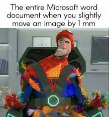
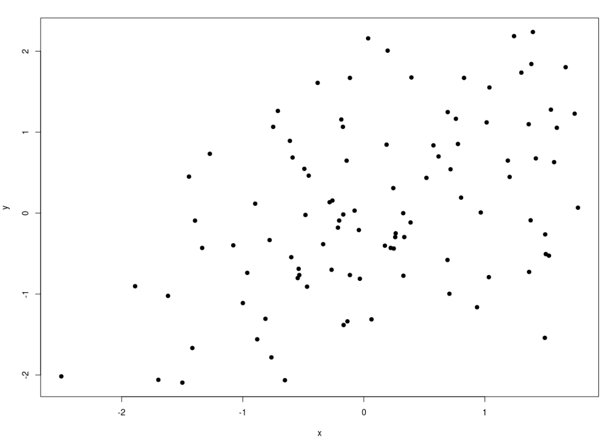
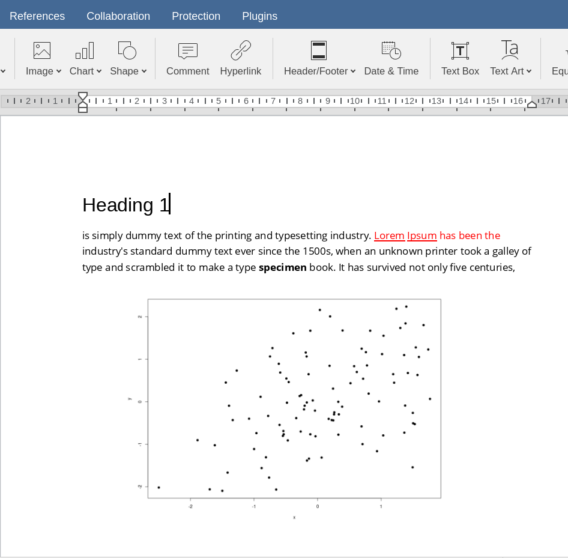

```{r setup, include=FALSE}
options(htmltools.dir.version = FALSE)
knitr::opts_chunk$set(echo = FALSE,
                      fig.align = "center",
                      dpi = 300,
                      fig.retina = 2)
```

# Making documents...

Se dovete scrivere qualcosa (un report, una tesi, un documento generico) cosa vi viene in mente di utilizzare?

--

Probabilmente **Microsoft Word** oppure **Google Docs**. Sono ottimi software, molto *intuitivi*, *facili da imparare* e *estramamente popolari*.

```{r, out.width="70%"}
knitr::include_graphics("img/word-example.png")
```

---

# The ~~pain~~ joy of making documents

Sicuramente però vi sarà capitato di dover fare operazioni complesse come:

- gestire documenti con molte pagine
- inserire (o modificare `r emo::ji("scream")`) figure e tabelle
- gestire bibliografia
- numerare paragrafi, tabelle e immagini

.pull-left[

```{r}
knitr::include_graphics("img/word_reddit_meme.gif")
```

]

.pull-right[

```{r}

```

]

---

# Why?

I programmi come Microsoft Word e affini sono definiti WYSIWYG (**W**hat **Y**ou **S**ee **I**s **W**hat **Y**ou **G**et) perchè quello che vediamo mentre scriviamo è esattamente il risultato finale:

- se vogliamo mettere **grassetto** usiamo `ctrl + b` oppure clicchiamo un pulsante e vediamo subito il risultato
- se vogliamo inserire un'immagine trasciniamo il file e la spostiamo millimetro per millimetro manualmente

--

Questo ha il vantaggio di essere molto intuitivo e semplice, ma ci sono diversi svantaggi:

- non abbiamo (quasi) mai una **visione d'insieme del documento** (sposto l'immagine e non so cosa succede)
- pensiamo **contemporaneamente** al testo e alla formattazione
- versioni di Word (o equivalenti) diverse possono creare problemi di compatibilità
- quando il documento diventa pesante (> 30 pagine) ci possono essere problemi di performance e formattazione

---

# Ok.. qualche alternativa?

L'approccio alternativo è caratterizzato da **separare la formattazione e impaginazione (tedioso, complicato e superfluo) dal contenuto effettivo** in termini di testo.

Questo è possibile utilizzando **linguaggi di markup** ovvero un modo di scrivere del testo che viene **intepretato e compilato** e permette di produrre un certo tipo di risultato. Ad esempio:

.pull-left[

```html
<!DOCTYPE html>
<html>
<body>

<h1>My First Heading</h1>

<p>My first paragraph.</p>

</body>
</html>
```

]

.pull-right[

```latex
\documentclass[12pt]{article}
\usepackage{lingmacros}
\usepackage{tree-dvips}
\begin{document}

\section*{Notes for My Paper}

Don't forget to include examples of topicalization.
They look like this:

\subsection*{How to handle topicalization}

I'll just assume a tree structure like (\ex{1}).

```

]

---

# HTML

Questo è un esempio per scrivere un testo in html:

```{r, out.width="100%"}
knitr::include_graphics("img/html-example-code.png")
```

---

# Latex

Questo è lo stesso esempio ma in Latex:

```{r, out.width="100%"}
knitr::include_graphics("img/latex-example-code.png")
```

---

# Ma cosa centra tutto questo con R?

Per documenti semplici effettivamente non è necessario imparare un linguaggio come `HTML` o `Latex`. Pensate però ad una tesi di laurea, ad un report di analisi o un documento scientifico in generale dove:

- inserire statistiche con un certo stile di formattazione
- modificare diversi numeri se ci sono cambiamenti nelle analisi
- aggiornare figure e tabelle se vengono modificate

Sarebbe fantastico poter non solo usare uno dei linguaggi di **markup** ma anche integrarlo con il nostro lunguaggio di programmazione preferito (R, Python, etc.).

## Questo in programmazione si chiama **Literate Programming**

---

# Un esempio?

Immaginate di scrivere un report per un'analisi che avete fatto in R e vogliate inserire un'immagine di un grafico. Usando word dovete:

- creare il documento e scrivere tutta la parte di testo
- inserire l'immagine da un file esterno

Cosa succede se l'immagine cambia? Dovete manualmente eliminare l'immagine precedente e inserire la nuova immagine. E cosa succede se 10 grafici che avete inserito sono da cambiare? (`r emo::ji("scream")`)

.pull-left[

```{r}

```

]

.pull-right[

```{r}

```

]

---

# Un esempio?

Nel **literate programming** invece l'idea è che un certo elemento (ad esempio un grafico) viene creato con un pezzo di codice (esempio in R) e quindi posso integrare il codice (e non l'immagine) con il testo. Essendo poi compilato, il testo sarà intepretato come testo ed il codice verrà sostuito dall'immagine:

.pull-left[

```{r echo=TRUE, eval=FALSE}
x <- rnorm(100)
y <- x*0.5 + rnorm(100) # correlazione di 0.5
plot(x, y, pch = 19)
```

]

.pull-right[

```{r out.width="40%"}
x <- rnorm(100)
y <- x*0.5 + rnorm(100) # correlazione di 0.5
plot(x, y, pch = 19)
```

]

---

# Literate programming (LP) in R?

Come abbiamo visto, per utilizzare LP abbiamo bisogno di un linguaggio di **markup** (HTML, Latex, etc.) e ovviamente di un linguaggio di programmazione. Tra tutti i linguaggi di markup, uno in particolare è emerso recentemente per semplicità, facilità di lettura e si apprende in circa 30 minuti: Il linguaggio [**Markdown**](https://www.markdownguide.org/basic-syntax/).

.pull-left[

```{r}
knitr::include_graphics("img/markdown-logo.svg")
```

]

--

.pull-right[

## Vediamo un esempio! https://dillinger.io/
(BTW queste stesse slide sono scritte in Markdown! 🤭)

]

---

# R Markdown

R Markdown è la fusione del linguaggio Markdown e dell'ambiente R per poter creare documenti, slide, siti web, curriculum, tesi, articoli scientifici combinando codice e testo.

.pull-left[

```{r}
knitr::include_graphics("img/rmd-logo.png")
```

]

.pull-right[

```{r comment=''}
knitr::include_graphics("img/rmd-example.png")
```

]

---

# Perchè R Markdown?

Scrivendo in `HTML` possiamo principalmente scrivere documenti `HTML` (visualizzabili con un browser web). Scrivendo in Latex possiamo creare principalmente documenti `PDF`. Il linguaggio Markdown può essere usato per produrre qualsiasi tipo di documento<sup>1</sup>:

```{r out.width="100%"}
knitr::include_graphics("img/rmd-workflow.png")
```

.footnote[
[R Markdown Cookbook](https://bookdown.org/yihui/rmarkdown-cookbook/rmarkdown-process.html))
]


